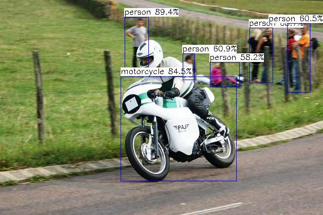

## Installation
Require TensorRT 8+ . Recommend use Nvidia official Docker image: [nvcr.io/nvidia/pytorch:**21.11-py3**](https://catalog.ngc.nvidia.com/orgs/nvidia/containers/pytorch)

**Create docker container**
```
#this docker image is tested, recommend pull this image
docker pull nvcr.io/nvidia/pytorch:21.11-py3

#create container
nvidia-docker run -it --name yolov5_tinytrt nvcr.io/nvidia/pytorch:21.11-py3 /bin/bash
```
**Install**
```bash
#clone project and submodule
git clone --recurse-submodules -j8 https://github.com/bot66/yolov5_tinytrt.git

#install dependencies
sudo apt-get update -y
sudo apt-get install cmake zlib1g-dev

#for python binding
sudo apt-get install python3 python3-pip
pip3 install numpy

#build
cd yolov5_tinytrt
mkdir build && cd build

cmake .. && make -j8
```
## Usage
Use TensorRT to speed up your model, you need parse it to TensorRT .engine format, you can use `build/tiny-tensorrt/tinyexec` to parse .onnx model to create .engine model.


```bash
#default yolov5s as example
#generate engine 
./build/tiny-tensorrt/tinyexec --onnx yolov5s.onnx --model yolov5s.engine

#inference
./build/yolov5_tinytrt images/ results/
```

## Reference
[ zerollzeng /
tiny-tensorrt
](https://github.com/zerollzeng/tiny-tensorrt)

[ ultralytics /
yolov5 ](https://github.com/ultralytics/yolov5)
